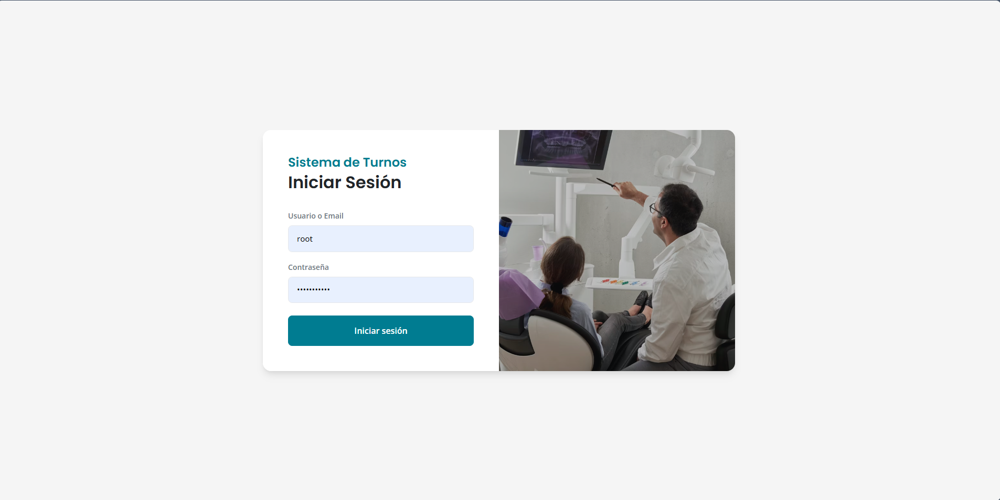
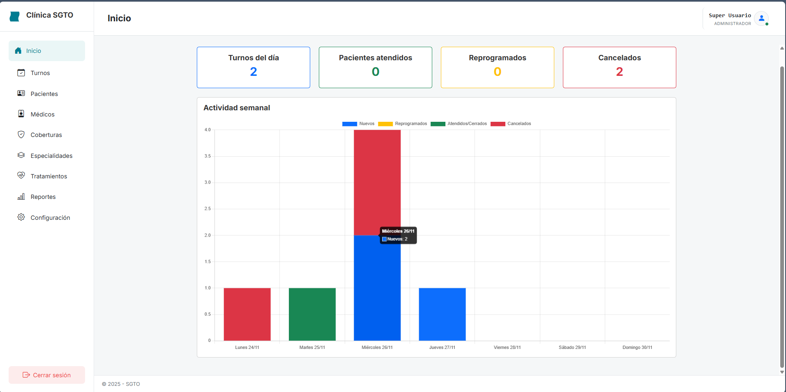
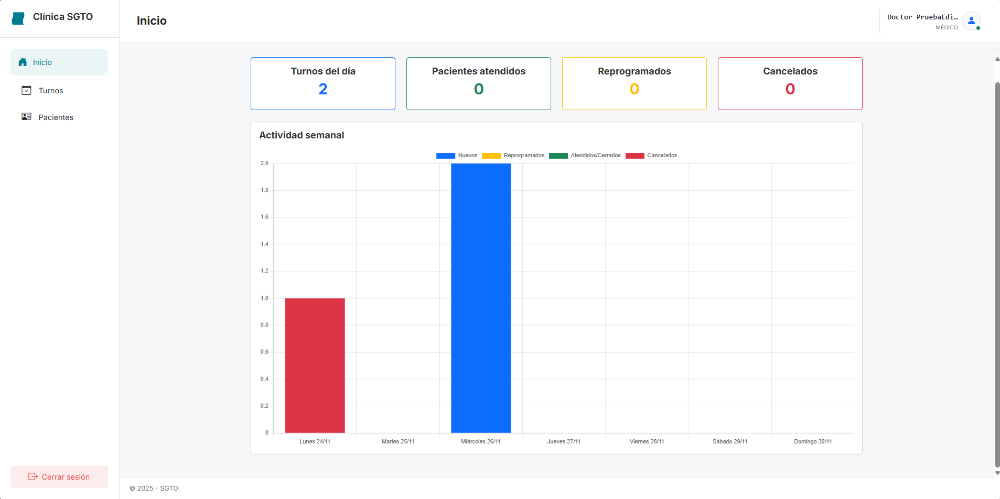
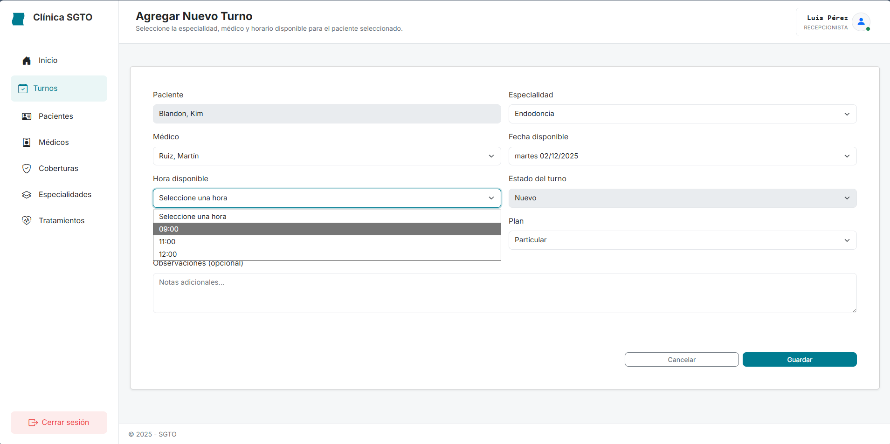
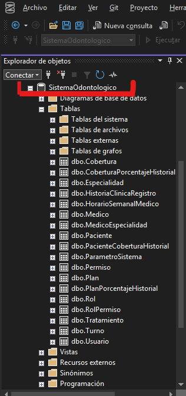
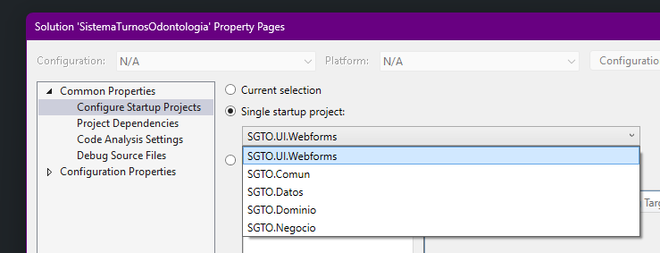

# Sistema de Gestión de Turnos – Clínica Odontológica

El Sistema de Gestión de Turnos Odontológicos (SGTO) es una aplicación web completa, desarrollada para administrar y optimizar la gestión de pacientes, médicos, especialidades, coberturas y la asignación de turnos dentro de una clínica odontológica.

El sistema está diseñado para manejar la disponibilidad de los especialistas proponiendo horarios y médicos en función de la especialidad seleccionada, y aplicando validaciones rigurosas para evitar conflictos de agendas y gestionar el ciclo de vida compelto del turno (nuevo, reprogramado, cancelado, cerrado, no asistió).

---

## Vista del Sistema
Se muestra a continuación la interfaz del usuario.

---

## Requisitos Funcionales Implementados

El SGTO cumple con los siguientes requisitos funcionales:
- **Dashboard de Inicio**: Muestra una visión general del estado actual de la clínica, incluyendo un gráfico de la data de turnos de la semana y KPIs clave por estado de los turnos. Esta vista es común para los 3 roles principales, la diferencia radica en que tanto Administrador como Recepcionista pueden ver toda la información, mientras que el rol Médico sólo puede ver los datos relacionados al usuario de manera que NO puede ver información que no le pertenezca.

- **Gestión de Maestros**: Creación, edición y baja lógica de PAcientes, Coberturas, Planes, Especialidades y Tratamientos.
- **Gestión de Personal**: Administración de Usuarios, Roles (Administrador, Recepcionista, Médico) y médicos (asociación de especialidades y definición de horarios semanales de trabajo).
- **Núcleo de Turnos**:
    * Asignación e turnos a pacientes y médicos.
    * Propuesta de horarios basada en especialidad y disponibilidad médica.
    * Validaciones de unicidad de turno (mismo médico, día, hora) y unicidad de paciente (mismo día, hora).
    * Manejo de estados de turno: Nuevo, Reprogramado, Cancelado, No Asistió, Cerrado.
    * Funcionalidad de reprogramación y cancelación (sin eliminación física).
    * Envío de confirmación por correo electrónico al paciente

- **Seguridad y Perfiles**: Implementación de un modelo de Roles y Permisos (RBAC) para controlar el acceso a módulos y acciones del sistema.
- **Módulo de Atención (Médicos)**: Permite al médico ver sus turnos y cargar el Registro de Historia Clínica asociado al turno, incluyendo el diagnóstico y el tratamiento realizado.
_ **Reportes**: Opciones de consulta y exportación de datos sobre turnos, pacientes, coberturas, etc.

---

## Tecnologías y Arquitectura

El proyecto estpa construido sobre tecnologías de Microsoft, siguiendo una arquitectura en capas para separar las responsabilidades.

| Lenguaje / Tecnología    |    Versión / Estilo       | Descripción                                           |
| ------------------------ | ------------------------- | ----------------------------------------------------  |
| Backend                  | .NET Framework 4.8        | Entorno de desarrollo                                 |
| Framework Web            | ASP.NET WebForms          | Framework para la interfaz de usuario                 |
| Base de Datos            | SQL Server                | Motor de base de datos relacional                     |
| Acceso a Datos           | ADO.NET                   | Implementación sin ORMs, LINQ                         |
| Estilo de Código         | Imperativo                | Enfoque directo y paso a paso en la lógica de negocio |

Este enfoque permitió afianzar los conocimientos en el paradigma de la programación imperativa al realizar instrucciones sobre cómo se deben ejecutar las mismas para obtener el resultado deseado que permiten observar cómo funciona todo en su forma más pura, algo que no se puede notar mucho al utilizar programación declarativa con herramientas como los ORMs o LinQ.

---

## Arquitectura Lógica de Capas

El sistema se organiza en 4 capas principales con una estricta separación de responsabilidades y una capa adicional para todas las clases comúnes:
- **Dominio**: Contiene los modelos de la realidad (Entidades, Objetos de Valor, Enums) y la lógica de negocio elemental.
- **Datos**: Responsable exclusiva de la comunicación con la base de datos a través de Repositorios, utilizando ADO.NET y consultas SQL manuales.
- **Negocio**: Contiene la lógica de negocio compleja, las validaciones de reglas, y coordina las operaciones entre la capa de Datos y la capa de Dominio.
- **UI WebForms**: Responsable de la interacción con el usuario (UserControls, Pages, eventos, postbacks), traduciendo las peticiones y mostrando la información.
- **Común**: Contiene clases comunes y reutilizables como helpers de validaciones o DTOS que se necesitan compartis (como el del dashboard).

---

# Instrucciones de Instalación y Configuración

## Requisitos Previos
- Visual Studio 2019 o superior (con soporte para .NET Framework 4.8).
- SQL Server (Se utilizó la versión 2019, pero cualquier versión moderna es compatible).
- Configuración del servidor de correo SMTP para la funcionalidad de envío de email (se puede configurar en el sub-módulo de Parámetros del Sistema dentro dle módulo de Configuración).

## Configuración de la Base De Datos
El sistema requiere la creación de la base de datos `SistemaOdontologico` y la carga de datos iniciales.
    1. **Ejecución del DDL**: Ejecutar el script de Definición de Estructura de Datos (DDL) que se encuentra en el archivo `Docs/Scripts/SQL Server/01_Script_DDL_SistemaOdontologico.sql`. Esto creará la base de datos, las tablas y las restricciones.
    2. **Carga de Datos Iniciales**: Ejecutar el script de Datos de Prueba (DML) que se encuentra en el archivo `Docs/Scripts/SQL Server/02_Script_DML_Datos_Prueba_SistemaOdontologico.sql`. Esto insertará:
        * Coberturas, Roles y permisos iniciales.
        * Datos de configuración del sistema (`ParametroSistema`), incluyendo el nombre de la clínica y la configuración inicial SMTP.
        * Usuarios, Médicos, Especialidades, Tratamientos y Paciente de prueba.
        * Horarios semanales y Turnos de ejemplo.

## Ejecución del Proyecto
    1. Verificar que la base de datos esté correctamente creada y configurada con los datos de prueba.

    2. En Visual Studio, establecer el proyecto SGTO.UI.Webforms como proyecto de inicio

    3. Compilar la solución
    4. Ejecutar el proyecto

## Credenciales de acceso
| Rol                      |   Nombre de usuario                      | Contraseña                  |
| ------------------------ | ---------------------------------------- | --------------------------  |
| Administrador            | root o root@sistema.com                  | clinica.tpc                 |
| Recepcionista            | lperez o luis.perez@sgto.com             | 123456                      |
| Médico                   | slopez o sofia.lopez@sgto.com            | 123456                      |
| Médico                   | nbenitez o nicolas.benitez@sgto.com      | 123456                      |

> Nota: La contraseña real se almacena con un hash en la base de datos, pero la contraseña de prueba indicada permite el acceso en el entorno de desarrollo.

